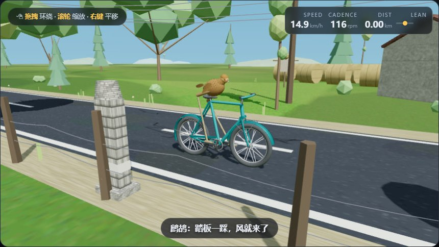

# 鹧鸪骑单车 3D · Partridge on Wheels



一只鹧鸪骑车。Three.js 单文件动画，**11.7 MB，双击就能跑**——
不需要联网、不需要装任何东西、不需要起服务器。

---

## ⚠️ 先构建：仓库里没有成品

克隆下来**直接双击是打不开的**。这个仓库只存源，11.7 MB 的
`partridge-3d.html` 是构建产物，不在版本库里。

```powershell
git clone https://github.com/yydshly/partridge-bike.git
cd partridge-bike
powershell -NoProfile -ExecutionPolicy Bypass -File .\_build.ps1
```

看到 `built partridge-3d.html  11,732,169 bytes` 就成了，
之后**双击 `partridge-3d.html`** 即可运行（`file://` 直开，不需要起服务）。

**为什么不把成品提交进来**：它是 252 KB 的 `_app3d.html` 拼出来的，
改一行源码就产生一个 11.7 MB 的新 blob。几轮改动后 `.git` 就会膨胀到
几百 MB，而换不回任何信息——那些内容都能重建。`_build.ps1` 需要三样东西，
全都在仓库里：`_app3d.html`、`bgm-1..8.mp3`、`_vendor/three149.min.js`。

## 怎么玩

| 操作 | 效果 |
|---|---|
| **拖拽** / **滚轮** / **右键** | 环绕 / 缩放 / 平移镜头 |
| **空格** | 播放 / 暂停 |
| **拖速度滑杆** | 加速（按住不放 = 持续给油） |
| **A** / **D** | 打方向 |
| **W** / **S** | 加速 / 刹车 |
| **N** / **B** | 上一首 / 下一首 |

面板里还有：重置、**自动巡航**、6 个机位预设、3 个时段（白天/黄昏/夜晚）、
4 种天气（晴/雨/雪/雾）、音乐控制、声音开关、鹧鸪叫声开关、
录 10 秒 WebM、保存当前帧 PNG。

**开自动巡航**，它会自己循线、遇对向车按余量选边让开、遇障碍收油，
还会冒几句「我从左边过去」。

## 里面有什么

- **5 km 一圈**，六段路：村口 → 河堤 → 林荫 → 长坡 → 镇子 → 长桥。
  换段会换风景、换曲子、喊一句报站。
- **时段 × 天气**是两张正交的表（3 × 4），改配色只改表、不改逻辑。
  雨会把路面打湿——反光变亮、胎噪也跟着变响；雪在地面盖一层白；
  雾缩短能见度。
- **鹧鸪是有状态的**：会累（骑久了说「腿有点酸」）、会被车吓到、
  雨天会抖水、侧方来车会扭头看、眼睛会眨——而且疲劳越高眨得越勤。
  它不掷骰子，每一次反应都由确定的输入决定。
- **车流**是对向车道 + 同向车道，右侧通行，会撞。
- **8 首配乐**（AI 生成），其中 6 首带歌词字幕。音乐走 `<audio>` 通道，
  录出来的 WebM **没有声音**。

## 仓库结构

| | |
|---|---|
| `_app3d.html` | **唯一可编辑源**（252 KB，带两个占位符） |
| `bgm-1..8.mp3` | 配乐源文件（8.2 MB，AI 生成，不可再生） |
| `_vendor/three149.min.js` | three.js r149，构建时内联 |
| `_build.ps1` | 把上面三样拼成 `partridge-3d.html` |
| `_checkall.ps1` | **一条命令跑完全部验证**（16 步） |
| `_*.tpl.html`（9 个） | 回归页模板，套桩用 |
| `_*.ps1` | 生成器与检查器 |
| `AGENTS.md` | 项目记忆与方法论（踩过的坑都在里面） |
| `.gitignore` | 排除 9 个产物：1 个成品 + 1 个探针 + 7 个回归页 |

**`.ps1` 必须是 UTF-8 with BOM。** 少了 BOM，PowerShell 5.1 会按 ANSI
解码中文，报出来的是莫名其妙的 `Unexpected token`，看起来像语法写错、
实际是编码被动了。所以仓库里放了 `.gitattributes` 关掉换行/编码转换。

## 验证

```powershell
powershell -NoProfile -ExecutionPolicy Bypass -File .\_checkall.ps1
```

16 步：构建 → 语法（源码 + 成品）→ 自由变量/作用域 ×2 → 重新生成六个回归页
→ 面板状态探针 → 作用域体检 → 交付自检 → 五套检查器的自检。

**它只证明「能生成、能通过静态检查」，证明不了画面。** 画面只能靠真机打开
`partridge-3d.html` 看一眼——2026-09-30 就交过一版**所有检查全绿、画面全黑**
的成品（`frame()` 里用了没声明的 `dt`，每帧抛 `ReferenceError`）。
所以**冒烟测试是交付流程的一部分，不是可选项**。

七套回归页是浏览器页面，脚本生成不了结论，要人眼各开一次（标题会变成
`PASS n/m`，那个才是这次的真实条数）：

`_driveharness` · `_trafficharness` · `_routeharness` · `_moodharness` ·
`_cruiseharness` · `_moodstate` · `_uistate`

它们不是手抄的，是 `_mk*.ps1` 从 `_app3d.html` **按标记切原文**再套一层桩，
所以测的就是产品真正在跑的那段代码。

## 许可与来源

- 渲染：[three.js](https://threejs.org/) r149，**已 vendored** 在 `_vendor/`，不联网拉取。
- 配乐：8 首 AI 生成的曲子，音频文件保留在仓库里。生成条款若有要求，请按实际情况补充本节。
- 画面、模型、代码：全部程序生成，无外部素材。
